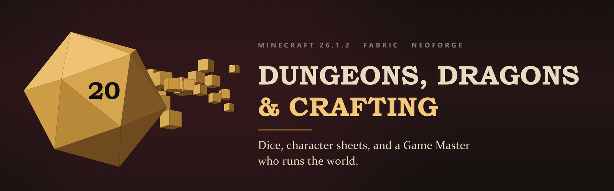

# DDC (Dungeons, Dragons & Crafting)

[](https://minecraft.net)
[](https://modrinth.com)
[](https://oracle.com/java)
[](LICENSE)
[](https://github.com/redstone-md/DDC/actions/workflows/ci.yml)
[](https://mcaf.managed-code.com)

**DDC** is a Minecraft Java Edition mod that merges tabletop roleplaying rules and storytelling (like Dungeons & Dragons) into Minecraft's 3D voxel world. It targets version **1.21.1** with native support for both **Fabric** and **NeoForge** — the version where Iron's Spells 'n Spellbooks and L_Ender's Cataclysm live, so DDC installs alongside them. Minecraft **26.1.2** stays supported on the [`mc-26.1.2`](https://github.com/redstone-md/DDC/tree/mc-26.1.2) branch.

DDC introduces an **asymmetric gameplay model**. Players explore the world as heroic characters with D&D classes, spell slots, and dice checks, while a **Game Master (GM)** controls the environment, possesses monsters, triggers sounds, and narrates the adventure in real-time.

> ### Status: 1.14.1
>
> **This page describes the full design. The released mod is smaller.** Shipping today: the rules
> engine, `/roll`, character sheets whose hit points are the player's real health, attack rolls
> against armour class, spells with slots, class mechanics, ability checks, classes, races, spells and
> encounters from data packs, the GM's wand, mob possession, world control, and GM narration.
> The PRD is built: dice tumble in the world, the action wheel is on `R` so nothing has to be typed,
> the sheet is on `C`, the GM panel is on `G`, the OBS overlay is a browser source you can paste a URL
> into, Twitch chat votes and channel points, and a natural 20 slows the world down and grades the
> screen gold. Characters level up, the fighter has manoeuvres, doors ask for a roll, and the guide
> explains all of it in the game. Everything the mod says is translated into English and Russian.
>
> Works with other mods when they are installed: Iron's Spells (mapped DDC spells cast as Iron's
> spells) and L_Ender's Cataclysm / Mutant Monsters (their bosses as GM encounters).
>
> One thing waits on a person, not code: **Modrinth publishing**. The release workflow has the step
> written and it stays dormant until the repo owner sets a `MODRINTH_PROJECT_ID` variable and a
> `MODRINTH_TOKEN` secret — publishing under someone's account is their decision, not mine.
>
> [**CHANGELOG.md**](CHANGELOG.md) lists exactly what is in the release and what is not.

🇷🇺 **[Нажмите здесь, чтобы прочитать README на русском языке.](file:///d:/projects/DDC/README.RU.md)**

---

## 🗺️ Repository Navigation & Documentation Map

- 📜 **Release**:
  - [CHANGELOG.md](CHANGELOG.md) — what 1.0.0 ships, and what it deliberately does not.
  - [LICENSE](LICENSE) — MIT; the built-in rules data pack is SRD 5.1 under CC-BY-4.0.
- 📑 **Root Instructions**: 
  - [AGENTS.md](file:///d:/projects/DDC/AGENTS.md) — Root AI development rules, workspace layout, and compiler properties.
- 📁 **Module Instructions**:
  - [common/AGENTS.md](file:///d:/projects/DDC/common/AGENTS.md) — Shared gameplay, mathematical calculations, and loader isolation.
  - [fabric/AGENTS.md](file:///d:/projects/DDC/fabric/AGENTS.md) — Fabric API integration, loader bootstrap, and Mixin security.
  - [neoforge/AGENTS.md](file:///d:/projects/DDC/neoforge/AGENTS.md) — NeoForge event handling, registry bus, and capabilities.
- 📘 **Product & Architecture Specs**:
  - [docs/PRD.md](file:///d:/projects/DDC/docs/PRD.md) — Product Requirement Document detailing features, UI, combat, and publishing rules.
  - [docs/ARCHITECTURE.md](file:///d:/projects/DDC/docs/ARCHITECTURE.md) — Technical layout, packet sync protocol, rendering pipelines, and Twitch sockets.
- 🏛️ **Architectural Decision Records (ADRs)**:
  - [0001-multi-loader-architecture.md](file:///d:/projects/DDC/docs/ADR/0001-multi-loader-architecture.md) — Choice of Gradle multi-project structures and Architectury API.
  - [0002-data-driven-ruleset.md](file:///d:/projects/DDC/docs/ADR/0002-data-driven-ruleset.md) — Data Packs for classes, spells, and code-free addon support.
  - [0003-gm-networking-sync.md](file:///d:/projects/DDC/docs/ADR/0003-gm-networking-sync.md) — Validation layers and C2S inputs compression for mob possession.

---

## 🎲 What 1.15.0 actually does

| Command | Who | What |
|---|---|---|
| `/roll <expr> [advantage\|disadvantage]` | anyone | Rolls dice; result goes to chat and the roll log of everyone within 32 blocks. |
| `/roll <expr> ... hidden` | Game Master | Rolls privately; nobody else sees the number. |
| `/ddc sheet` | anyone | Shows your class, level, hit points, proficiency, and abilities. |
| `/ddc class <id>` | anyone | Picks a class from any loaded data pack. |
| `/ddc race <id>` | anyone | Picks a race; its ability bonuses land on your sheet. |
| `/ddc cast <spell> <target>` | anyone | Spends a slot, rolls damage in public, rolls the target's save. |
| `/ddc rest` | anyone | A long rest: spell slots and hit points back. |
| `/ddc check <ability> <dc>` | anyone | An ability check: picking a lock, jumping a gap. Public. |
| `/ddc second-wind` | Fighter | Heals 1d10 + level, once per rest. |
| `/ddc channel-divinity` | Cleric | Turns the undead within 30 feet. |
| `/ddc narrate <text>` | Game Master | Letterboxed cinematic narration on every screen. |
| `/ddc world <change>` | Game Master | Day, night, storm, stop the clock, freeze the party. |
| `/ddc encounter <id>` | Game Master | Sets what the wand will place. The wand still chooses where. |
| `/ddc lock <ability> <dc>` | Game Master | Seals the block you are looking at: it asks for a check before it opens. |
| `/ddc unlock` | Game Master | Takes the seal off. |
| `/ddc xp <amount> [players]` | Game Master | Awards experience for the evening's talking rather than its fighting. |
| `/ddc sound <id>` | Game Master | Plays a soundscape for the whole table. |
| `/ddc maneuver <name> <target>` | Fighter | Spends a superiority die: trip, parry, push. |
| `/ddc action-surge` | Fighter | A few seconds of everything at once. |

**Nothing has to be typed.** Press `R` for the wheel: it makes your character, and then it plays
them. A Game Master holding the wand gets the wand's wheel instead — their encounters, one press away.
`C` is your sheet, `G` is the Game Master's panel. The commands below still work, and the wheel sends
them for you.

A **natural 20 slows the whole world** for a moment and grades the screen gold, so the table sees it
happen rather than reading about it in chat.

Attacks are resolved with the SRD's d20 against armour class: a miss cancels the damage and shows a
dodge, and the roll is hidden so only the attacker sees the numbers. The **Game Master's Wand** places encounters (right-click the ground, sneak-right-click to change
which one) and possesses creatures (right-click one, sneak to let go).

A Game Master is any player with operator level 2. The server checks this on every GM action; the
client is never asked.

**Add a class, race, spell or encounter with no code** — drop a file into any data pack and
`/reload`. Four directories are scanned across every namespace: `ddc_classes`, `ddc_races`,
`ddc_spells`, `ddc_encounters`.

```json
// data/my_addon/ddc_classes/paladin.json
{
  "name": "Paladin",
  "hit_die": "d10",
  "primary_ability": "strength",
  "saving_throws": ["wisdom", "charisma"]
}
```

### 🔗 Works with other mods

DDC needs no other mod, but connects to the big ones on 1.21.1 when they are there:

- **[Iron's Spells 'n Spellbooks](https://www.curseforge.com/minecraft/mc-mods/irons-spells-n-spellbooks)** — install it, and a DDC spell casts *as* an Iron's spell: fireball becomes Iron's fireball, sacred flame its guiding bolt, with its projectile, animation and light. DDC still owns the rules (your class, your slot, your range); Iron's owns the look. Which DDC spell maps to which Iron's spell is just data — a spell's `irons_spell` field — so **any Iron's addon works too**: its spells register into the same Iron's registry, so a data pack reaches them with no code. Without Iron's, DDC's own particle spells run unchanged. The bridge touches no Iron's code or asset — it reaches the mod's public API by reflection, so DDC ships nothing of theirs.
- **[Monsters & Spellbooks](https://www.curseforge.com/minecraft/mc-mods/monsters-spellbooks-iss)** and **[Hazen 'N Stuff](https://www.curseforge.com/minecraft/mc-mods/hazen-n-stuff)** (both Iron's addons) — `ddc-monsterspellbooks.zip` and `ddc-hazennstuff.zip` add their caster-monsters as GM encounters *and* a handful of their spells as castable DDC spells, the bridge above in action.
- **[L_Ender's Cataclysm](https://modrinth.com/mod/l_enders-cataclysm)** and **[Mutant Monsters](https://modrinth.com/mod/mutant-monsters)** — data packs (`ddc-cataclysm.zip`, `ddc-mutantmonsters.zip` on each release) put their bosses on the GM wand as set-piece encounters. See [`assets/integrations`](assets/integrations/).

---

## 🛡️ Gameplay Perspectives _(design intent; see the status note above)_

### 1. From the Player's Perspective _(shipped)_

Players experience the mod as an immersive 3D RPG:

1. **Character Sheet & HUD**:
   - Hearts and vanilla armor bars are replaced by a sleek, glassmorphic HUD displaying numeric **HP** (e.g., `45 / 45`), a **Class/Level** tag (e.g., `FIGHTER - LVL 5`), and **Armor Class (AC)** (e.g., `AC: 16`).
   - Spellcasters see active **Spell Slots** markers directly above their hotbar.
   - Pressing **`C`** opens the full Character Sheet for stats (STR, DEX, CON, INT, WIS, CHA) and gear management.
2. **Dice Checks in the World**:
   - Performing locks picks, jumping gaps, or breaking reinforced doors triggers a **d20 roll**. A 3D model of the die falls and bounces off the blocks in front of the player.
   - Nearby players see the rolling die. Once settled, the modifier is added and printed in chat (e.g., `[Player] Rolled a d20: 17 + 3 (DEX) = 20! (Success)`).
3. **Class Actions & Magic**:
   - **Fighters** use stamina to perform melee combat maneuvers.
   - **Wizards** must prepare spells in a *Spellbook* and cast them using *Wands* or *Staffs*, consuming spell slots.
   - **Rogues** deal sneak attack damage when striking from behind or in stealth.

---

### 2. From the Game Master's (GM) Perspective _(shipped)_

The GM does not play survival; they act as a director/storyteller:

1. **Spectator UI & GM Wand**:
   - GMs fly around in invisible spectator mode. Players are outlined with glowing indicators showing their health cards and targets.
   - Right-clicking blocks with the **GM Wand** opens radial action menus (e.g., spawn encounter, trigger traps, link triggers, lock chests).
2. **The Control Center (`G` key)**:
   - **Narrator**: Type narrative text (e.g., *"The air turns freezing cold as a low hum grows..."*). Sending it displays cinematic widescreen letterbox subtitles on the players' screens alongside atmospheric soundscapes (screeches, wind, thunder).
   - **Encounter Spawner**: Instantly place predefined mob groups (e.g., "Goblin Ambush") using a placement preview grid.
   - **Party Editor**: Hand out XP, restore spell slots, edit attributes, or prompt players to perform active rolls.
3. **Mob Possession**:
   - The GM can right-click any monster with the GM Wand to take direct control of it.
   - The camera snaps to the mob's eyes. The GM moves and attacks as the monster, using a custom boss bar and custom skill hotbars (e.g., "Flame Breath" for dragons).

---

### 3. From the Streamer / Twitch Audience Perspective ("Twitch-Ready") _(shipped)_

DDC is built to turn campaigns into interactive streaming content:

- **OBS Browser Overlay**: The client hosts a local WebSocket server that exports player stats, quests, and roll history to OBS. Viewers see live, animated D&D cards on stream with zero setup.
- **Fanfare & Cues**: Natural 20 rolls trigger screen shakes, slow-motion impact filters, and golden particle explosions on players' screens.
- **Chat Interaction**: Viewers can vote on check difficulties or vote to give streamers Advantage or Disadvantage on crucial saves.

---

## 🛠️ Quickstart Developer Setup

To build and compile the project, run:
Requires **JDK 21** — Minecraft 1.21.1's Java.

```bash
# Clone the repository
git clone https://github.com/redstone-md/DDC.git
cd DDC

# Build both jars and run the tests
./gradlew build

# Run a developer client
./gradlew :fabric:runClient
./gradlew :neoforge:runClient

# Run a dedicated server
./gradlew :fabric:runServer
./gradlew :neoforge:runServer
```

Jars land in `fabric/build/libs/` and `neoforge/build/libs/`. All unit tests must pass before pushing
to `main`; `./gradlew build` runs them.

The build maps against official Mojang mappings with Parchment names, so loom remaps both loader
jars. See [AGENTS.md](AGENTS.md) for the verified version matrix. The 26.1.2 build lives on the
[`mc-26.1.2`](https://github.com/redstone-md/DDC/tree/mc-26.1.2) branch, which ships unobfuscated and
declares no mappings.
