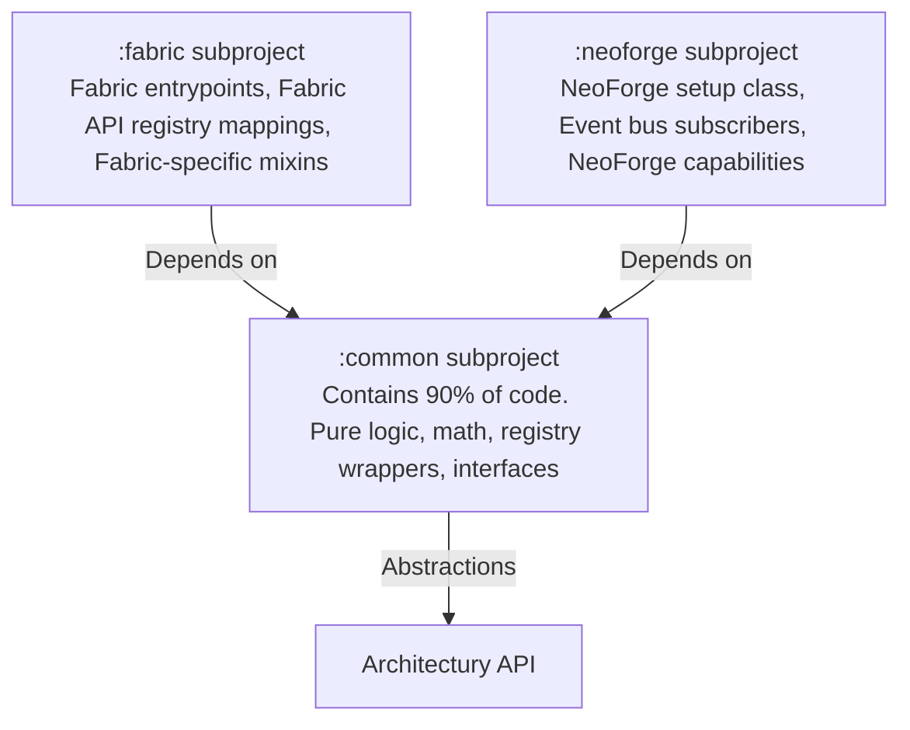
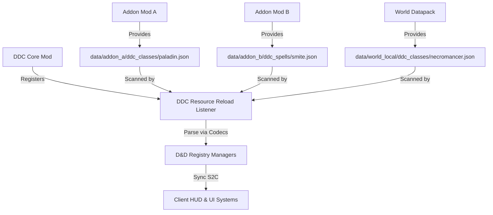
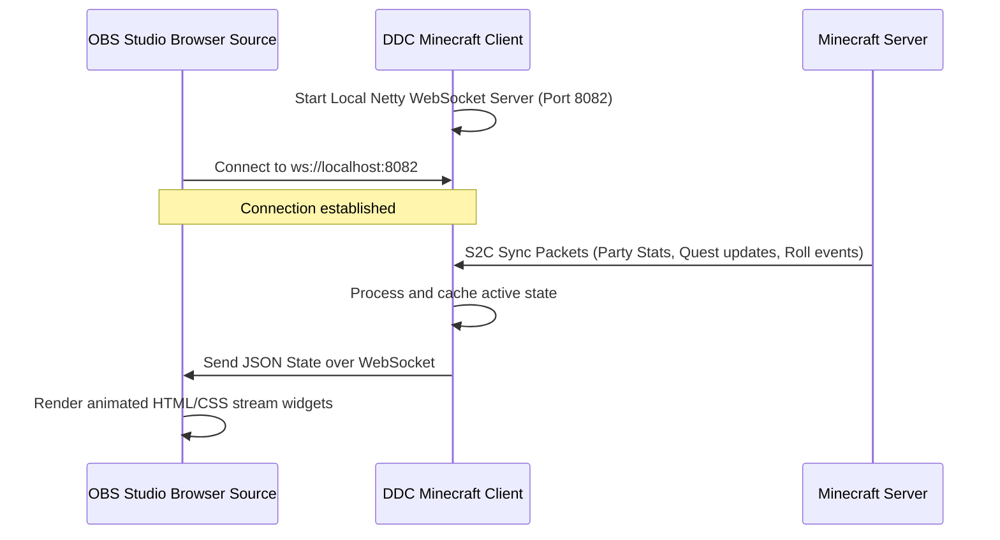

# DDC (Dungeons, Dragons & Crafting) - System Architecture & Technical Design

This document details the engineering architecture of the DDC mod for Minecraft version **26.1.2**. It covers the multi-loader project layout, the networking protocol for asymmetric GM-player gameplay, the data-driven RPG engine, and client-side rendering systems.

> **What is built as of 1.0.0**: the multi-loader layout, the data-driven class registry, the
> networking and its GM validation gate, character storage and sync, and the plain HUD, roll log, and
> narration overlay. The 3D dice pipeline, possession, the VFX stack, and the OBS WebSocket server
> are **design intent, not code** — see [CHANGELOG.md](../CHANGELOG.md). Sections describing them are
> kept as the plan to build against.

---

## 1. Multi-Loader Project Architecture

To support Fabric and NeoForge on Minecraft 26.1.2 without duplicating the core logic, we utilize a **multi-project Gradle layout** mediated by the **Architectury API** and Gradle Loom.



### Module Structure
1. **`:common`**:
   - Compiles core class files, items, registry definitions, networks interfaces, and capabilities containers.
   - Depends only on Architectury API common interfaces and vanilla Minecraft.
2. **`:fabric`**:
   - Fabric entrypoints (`ModInitializer` and `ClientModInitializer`).
   - Registers Fabric networking receivers and registers items to Fabric's registry mapper.
   - Mixins targeting Fabric-specific internals or loaders.
3. **`:neoforge`**:
   - NeoForge Mod class annotated with `@Mod("ddc")`.
   - Binds event listeners to the NeoForge event bus (e.g. key inputs, client setup, capabilities attachment).
   - NeoForge registries integration.

---

## 2. D&D Rules Engine, Data Packs & Addon Integration

DDC implements a fully **data-driven D&D engine** using Minecraft Data Packs. This separates game rules from code compilation and enables a modular, code-free **addon ecosystem**.



### Addon Registration Pipeline
To enable seamless addon compatibility, DDC's `RegistryReloadListener` implements a cross-namespace resource scan:
1. **Dynamic Scanning**: Instead of querying files strictly under the `ddc` namespace, the engine calls `ResourceManager#listResources` targeting `ddc_classes`, `ddc_spells`, and `ddc_races` across **all active namespaces** (e.g. `addon_a`, `addon_b`, `ddc`).
2. **Merging Strategy**: If two addons define the same namespace and ID (e.g., `addon_a:ddc_classes/fighter.json` and a world datapack provides `addon_a:ddc_classes/fighter.json`), the standard Minecraft resource pack resolution order applies, allowing server administrators to override addon parameters on a per-world basis.
3. **Registry Events**: Addons that require custom Java logic can subscribe to DDC's registry event callbacks (e.g., `DDCRegistryEvents.CLASS_REGISTERED`) to bind custom active skills or special potion effects.

### JSON Codec Structure
We define custom Codecs for parsing RPG stats. For example, a spell definition JSON:
```json
{
  "spell_id": "ddc:fireball",
  "level": 3,
  "school": "evocation",
  "cast_time": "action",
  "components": ["verbal", "somatic", "material:bat_guano"],
  "range": 150,
  "area_of_effect": {
    "type": "sphere",
    "radius": 20
  },
  "effects": [
    {
      "type": "damage",
      "damage_dice": "8d6",
      "damage_type": "fire",
      "saving_throw": {
        "attribute": "dexterity",
        "effect_on_success": "half_damage"
      }
    }
  ]
}
```

### Character Storage (implemented: world saved data, not attachments)
Character sheets are stored in the world's own saved data (`SavedData`, keyed per player UUID against
the overworld), **not** attached to the player entity.

The original plan here was a per-loader attachment: Architectury/Cardinal Components on Fabric,
capabilities on NeoForge. That would have meant two implementations of one idea, in the loader
modules, against the "90% in common" rule. One vanilla `SavedData` is the same code on both loaders,
and because it was never tied to an entity it survives death and dimension changes with no extra
work. Revisit only if sheets need to live on non-player entities.

Data is synchronised to its owner via the S2C `ddc:character_sheet` payload on join, on respawn, and
on every change — every write goes through `CharacterService`, so no path can change a sheet and
forget to sync it. Maximum hit points ride along in the payload because deriving them needs the class
definition from the data packs, which the client does not have.

---

## 3. Networking Protocol & GM Sync

Asymmetric play requires rapid, low-overhead sync packets between the GM and the server. All custom payloads are defined as Java `record` types implementing Architectury's `CustomPacketPayload`.

| Payload ID | Type | Sender | Description |
|---|---|---|---|
| `ddc:dice_result` | S2C | Server | **Built.** Roll result as roller, notation, mode, and seed; nearby clients replay the seed rather than being told the number. |
| `ddc:character_sheet` | S2C | Server | **Built.** The player's own sheet plus derived max hit points. |
| `ddc:narrate` | S2C | Server | **Built.** Cinematic narration text, sent only after the server has checked the sender is a GM. |
| `ddc:possess_mob` | C2S | GM | *Planned.* GM requests to possess a specific target entity. |

There is deliberately **no C2S roll or narrate payload**. Both are requested through commands, which
already carry Brigadier's parsing and permission plumbing, so there is no second, hand-written entry
point into the same authority to keep secure.

### Security Validation Gate
To prevent cheating, the server acts as the absolute authority.

Minecraft 26 replaced numeric operator levels with named permissions, so `hasPermissions(2)` no
longer exists. The level-2 equivalent is `Permissions.COMMANDS_GAMEMASTER`, and every GM capability
goes through the one gate in `com.ddc.gm.GameMasters`:

```java
public final class GameMasters {
    private static final PermissionCheck CHECK =
            new PermissionCheck.Require(Permissions.COMMANDS_GAMEMASTER);

    public static boolean isGameMaster(ServerPlayer player) {
        return CHECK.check(player.permissions());
    }

    public static <T extends PermissionSetSupplier> Predicate<T> requirement() {
        return Commands.hasPermission(CHECK);
    }
}
```

A server running a permissions plugin grants that permission through its own provider, which covers
ADR-0003's "or specified by permission plugins" with no extra support.

`requirement()` shapes the command tree and hides GM branches from ordinary players' completions. It
is **not** a security boundary: handlers call `isGameMaster` again before acting, because a command
tree only describes what a client is offered, not what it can attempt.

---

## 4. Client-Side Rendering Systems

DDC alters the player HUD and adds custom 3D rendering elements.

```
                  +-----------------------------------+
                  |        Minecraft Frame            |
                  +-----------------------------------+
                                    |
            +-----------------------+-----------------------+
            |                                               |
            v                                               v
+-----------------------+                       +-----------------------+
|  Glassmorphic HUD     |                       |  3D Dice Renderer     |
|  - Overlays HP/AC     |                       |  - LWJGL Instanced    |
|  - Custom Class icons |                       |  - Bullet Physics/    |
|  - Spell Slots bar    |                       |    Custom lightweight |
+-----------------------+                       +-----------------------+
```

### 1. Glassmorphic Character HUD
- Renders using standard Minecraft GUI pipeline during the render overlay events.
- Utilizes custom blit shaders to create semi-transparent glass backgrounds with blurred behind-GUI elements (mimicking macOS glassmorphism).

### 2. 3D Dice rendering pipeline
- Dice are not block entities (for performance). They are rendered using a custom client-side render layer during the `RenderLevelStageEvent`.
- Uses a lightweight mathematical physics solver to simulate die collisions against the voxel boundaries of the world.
- When the server broadcasts `ddc:dice_result` containing a physics seed, all nearby clients run the identical deterministic physics simulation, ensuring everyone sees the die bounce and land on the same number.

### 3. Spectator VFX & Cinematic Pipeline
To ensure high visual engagement for streams, DDC implements a post-processing shader stack:
- **Cinematic Letterboxing & Fog**: When the GM triggers narration, the client activates a post-process overlay shader that renders animatable black cinematic bars and adjusts the rendering engine's fog density parameters (`RenderSystem#setShaderFogStart`/`End`) to generate thick thematic atmosphere.
- **Natural 20 Screen Shake & Slow-Motion**:
  - The client interceptor monitors roll results. Upon receiving a `Natural 20`, the game camera matrices (`Matrix4f`) are offset using high-frequency noise for 15 ticks to create a screen shake effect.
  - The client activates a brief color grading shader (bumping contrast and golden saturation) and drops the rendering frame interpolation speed (creating a pseudo slow-motion impact effect on client-side entity animations).
- **Ground Rune Decals**: Spellcasters project visual boundaries on the ground using standard buffer builders mapping alpha-blended rune textures during the level rendering stage, projecting dynamic decal meshes over existing voxel geometry.

---

## 5. Streamer Web Integration (OBS Source)

DDC includes an optional built-in HTTP and WebSocket server running locally on the client to communicate with streaming software (like OBS Studio or Streamlabs):



### WebSocket Data Protocol
The client runs a lightweight Netty-based server on a background thread. When the client receives character syncing or roll events from the server, it instantly serializes the data to JSON and broadcasts it to connected WebSocket clients:
```json
{
  "event": "dice_roll",
  "data": {
    "player": "StreamerName",
    "class": "Wizard",
    "die_type": "d20",
    "natural_roll": 20,
    "modifier": 4,
    "total": 24,
    "is_critical_success": true
  }
}
```
This enables streamer widgets (e.g. roll alerts, active party HP cards, and level progress meters) to react in real-time with zero OBS performance impact.
